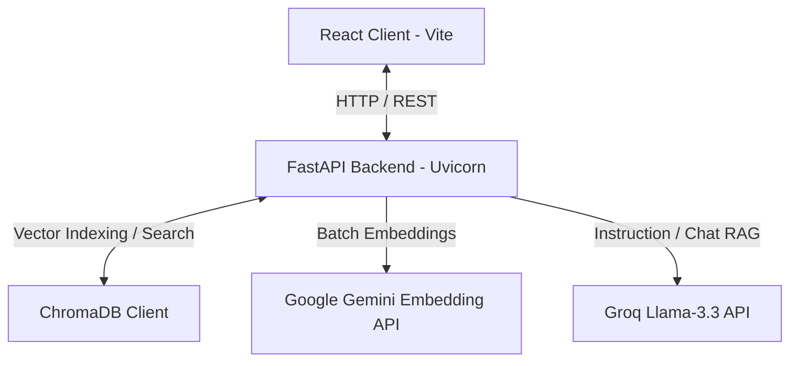

# StudySphere AI

StudySphere AI is an elegant, dark-academic study workspace that synthesizes your textbooks, course notes, and research papers into interactive chat sessions, multi-level outlines, customizable summaries, interactive flashcards, visual learning diagrams, and academic quizzes.

Powered by a lightweight, high-performance RAG (Retrieval-Augmented Generation) pipeline, StudySphere AI uses **FastAPI** on the backend, **React** on the frontend, **ChromaDB** for semantic search, **Google Gemini** for vector embeddings, and **Groq** for high-speed, advanced answer generation.

---

## 🏛️ System Architecture & Technology Stack



### 1. Frontend
* **Core**: React, TypeScript, Vite
* **Styling**: Tailwind CSS (custom dark-academic theme)
* **Visuals**: Lucide Icons, Mermaid.js (for concept flowcharts)
* **State & Caching**: Custom React Context with local storage session sync (no remote user database needed)

### 2. Backend
* **Web Framework**: FastAPI (fully asynchronous endpoint handlers)
* **Client Networking**: HTTPX Async Client (for low-latency cloud embedding requests)
* **Text Chunking**: Semantic Recursive Character Text Splitter

### 3. RAG Pipeline
* **Embeddings**: Google Gemini API (`gemini-embedding-001` model at 768 dimensions using Matryoshka dimensionality reduction)
* **Vector Store**: ChromaDB (disk-persisted local vector database with size-limited FIFO query caches and automated schema migrations)
* **LLM Engine**: Groq API (`llama-3.3-70b-versatile` system prompt guided model)

---

## 🚀 Local Deployment Guide

Follow these steps to run the application locally on your machine.

### Prerequisites
* **Node.js** (v18+)
* **Python** (3.9+)
* **API Keys**:
  * [Google Gemini API Key](https://aistudio.google.com/)
  * [Groq API Key](https://console.groq.com/)

---

### Manual Setup (Step-by-Step)

#### 1. Setup the Backend Server
1. Navigate to the `backend` folder:
   ```bash
   cd backend
   ```
2. Create and activate a Python virtual environment:
   ```bash
   python3 -m venv venv
   # On macOS/Linux:
   source venv/bin/activate
   # On Windows:
   venv\Scripts\activate
   ```
3. Install required packages:
   ```bash
   pip install -r requirements.txt
   ```
4. Configure your environment variables. Copy `.env.example` to `.env`:
   ```bash
   cp .env.example .env
   ```
5. Edit `.env` and fill in your API keys:
   ```env
   GROQ_API_KEY="your-groq-key"
   GEMINI_API_KEY="your-gemini-key"
   EMBEDDING_PROVIDER="gemini"
   EMBEDDING_MODEL_NAME="gemini-embedding-001"
   ```
6. Start the server using Uvicorn:
   ```bash
   python -m uvicorn app.main:app --port 8000 --reload
   ```
   The backend API will be live at `http://localhost:8000`. You can access interactive Swagger docs at `http://localhost:8000/docs`.

---

#### 2. Setup the Frontend Client
1. Open a new terminal window and navigate to the `frontend` folder:
   ```bash
   cd frontend
   ```
2. Install the required Node packages:
   ```bash
   npm install
   ```
3. Create a `.env` file (if it doesn't exist):
   ```env
   VITE_API_URL="http://localhost:8000"
   ```
4. Start the Vite development server:
   ```bash
   npm run dev
   ```
   Open your browser and navigate to `http://localhost:3000` to access the application dashboard.

---

### Docker Deployment (Alternative)

To build and run both the frontend and backend containerized:

1. Make sure Docker is running on your machine.
2. Edit the `.env` variables in `backend/.env` with your API keys.
3. Build and launch the containers:
   ```bash
   docker-compose up --build
   ```
4. Access the web interface at `http://localhost:3000`.

---

## 🎨 Key Features & Usage

* **📖 Cataloged Bibliography**: Upload PDFs, DOCX files, or TXT documents. Documents are parsed, split, embedded via Gemini, and cataloged client-side in the sidebar.
* **💬 Scholarly Chat Client**: Interact with your papers using a localized context-aware RAG search. Click on sources to see which document chunks were used to generate the answer.
* **🎓 Assessment Hub**: 
  * **Interactive Quizzes**: Generates custom MCQ exams based strictly on your document. Includes real-time performance tracking with detailed answer explanations.
  * **Active Flashcards**: Generates flip-based cards to review definitions and core facts.
  * **Visual Learning Outline**: Builds interactive concept maps and flows generated on-the-fly using Mermaid formatting.
* **📊 Analytics Dashboard**: Tracks study session streaks, intellective study hours, cataloged file counts, and average quiz scores dynamically.
